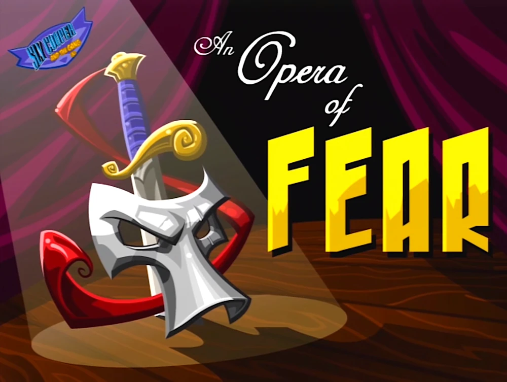

*Warnings*

Para la realización de esta actividad voy a tener los siguientes supuestos:
+ Eres capaz de leer y entender oraciones **largas** y eres capaz de comprender **lo que hay que hacer**.
+ Eres capaz de manejar rutas relativas y absolutas con precisión y te tomas en serio la actividad. Si no realizas las rutas correctamente, no voy a hacer mi trabajo *(tendrás un 0 en el apartado)*
+ Cada actividad va a ser corregida de forma *individual* y separada del resto de actividades.
+ Soy consciente de que estamos tratando retos que no hemos trabajado en profundidad en clase, por ello mismo no tengais miedo en hacer preguntas.
+ Cuando haceis comandos, recomiendo encarecidamente apuntarlos puesto que serán relevantes más adelante.
+ Si alguien realiza algún tipo de *prestidigitación* o *plagio* lo sabré.

Una Opera de Miedo
==============================



*Bienvenidos a Venecia para una NOCHE MÁGICA*

Don Octavio Vincenetti os ha contratado para la preparación de su retorno triunfal al mundo de la opera justo cuando os avisa de que tiene un **gran problema**. Han informatizado toda la orquesta y el público está listo para su regreso, pero está cundiendo el **caos** absoluto entre todos los artistas: se han perdido instrumentos, encargados de seguridad han desaparecido, los musicos están desconcertados, se ha atascado el baño y no se conoce el orden de la obra. La actuación es esta misma noche, asi que el tiempo apremia.

La situación es la siguiente, tenemos una serie de instrumentos *(usuarios)* y una serie de carpetas en los atriles (`/usr/sor`) que contienen las partituras que tienen que tocar. Pero por desgracia unos musicos son muy torpes con las partituras y estan entrando cuando no les toca o están tocando lo que no es, *¡TODO ES EL CAOS!*

# Usuarios

Los usuarios que se han de crear o verificar en los sistemas son los siguientes:
- Oboe
- Clarinete
- Flauta
- Guitarra
- Corno
- Cello
- Contrabajo
- Sistro
- Timbal
- Director

# Grupos

Los grupos de la orquesta son los siguientes:

- Cuerda
- Viento_metal
- Viento_madera
- Percusion
- Director
- Orquesta

Los instrumentos se dividen en los siguientes grupos de la siguiente forma:

| Instrumentos  | Cuerda    |    Viento_madera  |  Viento_metal |   Percusion   |  Director     |    Orquesta   |
|  :----------: | :-------: | :-------------:   | :-----------: | :----------:  | :---------:   | :---------:   |
|   Oboe        |           |     X             |               |               |               |       X       |
|   Clarinete   |           |     X             |               |               |               |       X       |
|   Corno       |           |                   |       X       |               |               |       X       |
|   Flauta      |           |                   |       X       |               |               |       X       |
|   Cello       |    X      |                   |               |               |               |       X       |
|   Contrabajo  |    X      |                   |               |               |               |       X       |
|   Guitarra    |    X      |                   |               |               |               |       X       |
|   Timbal      |           |                   |               |       X       |               |       X       |
|   Sistro      |           |                   |               |       X       |               |       X       |
|   Director    |           |                   |               |               |  X            |       X       |


## Tarea 1

Haz un script que añada los usuarios y grupos necesarios para configurar el sistema.
Permite establecer las contraseñas de los usuarios de una forma *desantedida*

Para cada usuario, el sistema deberá comprobar si ha sido creado ya, y si está creado deberá mandar un mensaje personalizado indicando que se ha saltado la creación de ese usuario.

Es una muy buena idea crear un fichero que contenga todos los usuarios.

# Acto I: Obertura

El concierto cuenta con 2 trabajos, los cuales son:
- Il barbiere di Siviglia: Carpeta `/usr/sor/Il_barbiere_di_Siviglia`
- Le nozze di Figaro: Carpeta `/usr/sor/Le nozze di Figaro`

En cada una de las carpetas están las partituras de cada uno de los instrumentos explicados previamente, las cuales vamos a *simular* con un `.txt` que contiene el nombre del instrumento y su nombre será su nombre propio. 

**Ejemplo**
Para el usuario `Oboe` en la obra *Il barbiere di Siviglia* (`/usr/sor/Il_barbiere_di_Siviglia`) deberá existir un archivo llamado `Oboe.txt` y el contenido del archivo será el nombre del usuario (`Oboe`)

Las demandas del director son las siguientes:
1. Cada instrumento puede leer y escribir *únicamente* en su partitura.
2. Cada grupo de instrumentos puede *leer* aquello en su grupo pero no *escribir*.
3. El director de orquesta puede leer y escribir en TODAS las partituras. (Por eso es el director)

## Tarea 2

Haz un script llamado "act01.sh" con las ordenes necesarias. Usar variables para almacenar los paths e implementar bucles es buena idea.

## Vista de los espectadores

Con el fin de que los asistentes puedan ver el espectáculo, se ha pensado crear un usuario `espectador` que pueda acceder por medio de SSH a la maquina para conocer el programa.

Para la configuración de este usuario se ha de configurar **OpenSSH Server Service** puesto que es necesario para cumplir con los requisitos.

- Antes de pedir la contraseña al usuario se deberá mostrar el `Banner` que podreis encontrar en el fichero `banner.txt`, debereis colocarlo en la carpeta `etc/`

- En el evento en el que el usuario haga sesión, deberá poder hacer una unica acción.
    * Mostrar los contenidos de la carpeta `/src/sor` asi como una lista de los **trabajos** a interpretar.

//aqui va imagen ejemplo

# Acto II: Andante

El primer acto ha conseguido salir adelante, pero hay un problema mayor, alguien ha tirado todas las carpetas al suelo y han quedado mezcladas las partituras y documentos de la obra. Como Don Octavio ha terminado la Obertura unicamente habria que gestionar las partituras de `Le nozze di Figaro`

El director de orquesta te encarga que rapidamente recoloques todos los documentos en su lugar, pero para hacerlo correctamente pueden darse tres casos.

1. La carpeta de un determinado instrumento no tiene partituras: Entonces se deberá formar la siguiente estructura en el directorio HOME del usuario.

*Ejemplo para el usuario Oboe*

````Bash
Oboe/
    Oboe.txt
    Acto I/
        Oboe_1.txt
    Acto II/
        Oboe_2.txt
    Acto III/
        Oboe_3.txt
    Acto IV/
        Oboe_4.txt
````

2. Comprobar si el usuario esta en la carpeta correcta y si tiene los permisos establecidos correctamente.

**Ejemplo de uso**
````Bash
./act02.sh Oboe Test
    *Test 1: El usuario Oboe existe
    *Test 2: Error, el usuario no tiene Oboe.txt
    *Test 3: Error, el usuario no puede leer Oboe.txt
    --Acto I/ existe y puede ser leido por Oboe
    --Acto I/Oboe_1.txt existe y puede ser leido por Oboe
    --Acto II/ existe y puede ser leido por Oboe
    ...
````
3. En el caso de encontrar una carpeta alterada limpiar la carpetas y subcarpetas de su interior SIEMPRE que lo haga un usuario dentro del mismo grupo musical. 

## Tarea 3

Realizar un Script llamado act02.sh que reciba 2 parametros siendo el primero un **Usuario Valido** del sistema, si no lo fuere deberá mostrar un mensaje de error. El segundo parametro deberá de ser una de las siguientes palabras.

1. Reestablecer
2. Probar
3. Limpiar

En el caso de Probar y Limpiar se debera comenzar desde el directorio con el mismo nombre que el usuario.

# Acto III: Finale

Tras atender a todas las demandas del conductor con éxito recibes la siguiente nota:

 > Estimado becario,
 >
> Don Octavio ha estado detrás de todos los incidentes de la Opera de hoy. Ha estado trabajando como lider de las Vívoras Verdes, arruinando lentamente la ciudad y empobreciendo al pueblo para su beneficio personal. Por favor, pido tu ayuda para acabar con su actuación.
 >
 >Atentamente Tux

Aprovechando la oportunidad de vengarte del conductor, completa las siguientes tareas:

# Tarea 4

Haz un script llamado act03.sh que que acepte un argumento que puede ser:

+ Todo (--all)
+ Acto 1 (--01)
+ Acto 2 (--02)
+ Acto 3 (--03)
+ Acto 4 (--04)

El script deberá borrar todos los ficheros y carpetas del acto indicado o todo. Si se le pasa un argumento deberá de dar un mensaje de aviso indicando que no se le ha pasado un argumento válido.

# Tarea 5

Crea un script llamado finale.sh que pueda aceptar 2 argumentos.

+ instrumentos (--instruments/-i)
+ grupos (--groups/-g)

Debe aceptar tanto **-g** como **--group** para grupos e igual para instrumentos.

Si el argumento es instrumentos el script deberá para cada usuario dentro de la orquesta:

+ Comprobar si existe.
+ Borrar su directorio `Home`.
+ Eliminarlo de shadow y passwd.
+ Mostrar mensajes de cada operacion.

Si el argumento es grupos el script deberá para cada grupo dentro de la orquesta:

+ Comprobar si el grupo existe, si no existe mostrará un mensaje y avanzará al siguiente grupo.
+ Extraer todos los usuarios que pertenezcan al grupo del grupo.
+ Eliminar el grupo.
+ Mostrar mensajes de cada operación.

# Tarea 6

Corrige los scripts y envialos por moodle. Mucho animo.


